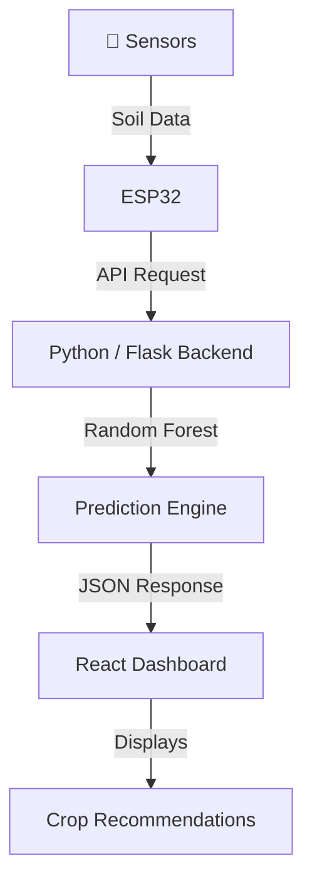

<div align="center">

# 🌾 Agrios
### Smart Agriculture & Soil Monitoring Platform

<p>
  
  
  
  
  
  
</p>

*Bridging hardware and data science to help farmers make smarter, data-driven decisions.*

[View UI Prototype →](https://www.figma.com/design/RBaWeVqrP5sa5RwgwGDu2B/Sans-titre?node-id=0-1&t=7e75SfTGfStia9p7-1)

</div>

---

## 📖 Overview

**Agrios** is an end-to-end IoT + Machine Learning platform designed to monitor soil conditions and deliver intelligent crop recommendations. It combines real-time sensor data collection, a Python-based ML prediction engine, and a responsive React dashboard — giving farmers and agronomists actionable insights at a glance.

---

## 🚀 The Three Pillars

| 📡 IoT Layer (ESP32) | 🧠 ML Backend (Python) | 💻 Web Dashboard (React) |
| :--- | :--- | :--- |
| Real-time soil data collection via simulated sensors running on Wokwi. | Random Forest analysis of soil conditions for intelligent crop prediction. | Responsive visualization of sensor data and recommendations for farm insights. |

---

## 🧩 System Architecture



---

## ✨ Key Features

- ✅ **Real-time Monitoring** — Simulated sensor data streams via ESP32 & Wokwi
- ✅ **Predictive Intelligence** — Smart crop recommendation engine powered by Random Forest
- ✅ **Responsive UI** — Clean, modern dashboard built with Vite + React
- ✅ **Modular Architecture** — Decoupled layers make it easy to swap or extend any component
- ✅ **Scalable** — Designed for straightforward adaptation to physical IoT deployment

---

## ⚙️ Setup & Installation

### Prerequisites

- [Node.js](https://nodejs.org/) (v18+)
- [Python](https://www.python.org/) (3.9+)
- [VS Code](https://code.visualstudio.com/) with the [Wokwi Simulator](https://marketplace.visualstudio.com/items?itemName=wokwi.wokwi-vscode) extension

---

### 1️⃣ Hardware Simulation (Wokwi)

Simulate the ESP32 sensor environment directly in VS Code.

```bash
# Open the soil directory in VS Code
code ./soil
```

1. Ensure the **Wokwi Simulator** extension is installed and active.
2. Press `F1` and run **Wokwi: Start Simulator**.

---

### 2️⃣ Machine Learning API

This module processes incoming soil data and returns crop predictions.

```bash
cd ml_module

# Step 1 — Rebuild the model
# Open MDL.ipynb in Jupyter and run all cells → generates 'soil_model.pkl'

# Step 2 — Start the API server
python app.py
```

> 📍 API available at: `http://127.0.0.1:5000`

---

### 3️⃣ Frontend Dashboard

Interactive interface for monitoring sensor data and viewing recommendations.

```bash
cd website
npm install
npm run dev
```

> 🌐 Dashboard available at: `http://localhost:5173`

---

## 🎨 UI/UX Design

The interface was carefully designed to be intuitive and accessible for both farmers and administrators.

> 🔗 **Interactive Prototype:** [View on Figma](https://www.figma.com/design/RBaWeVqrP5sa5RwgwGDu2B/Sans-titre?node-id=0-1&t=7e75SfTGfStia9p7-1)

---

## 🗺️ Roadmap

- [ ] Integration with real-world physical IoT sensors
- [ ] Mobile application using React Native
- [ ] Advanced weather API integration for improved forecasting
- [ ] Multi-farm / multi-user support with role-based access

---

## 👥 The Agrios Team

## 👥 The Agrios Team

| Name | Role |

| **Yassine Maarouf** | IoT |
| **Fatima Ezzahrae Baiha** | Backend & Machine Learning |
| **Hasna Hamdani** | Development & UI/UX |
---

<div align="center">
  <sub>Built with 🌱 by the Agrios Team</sub>
</div>
